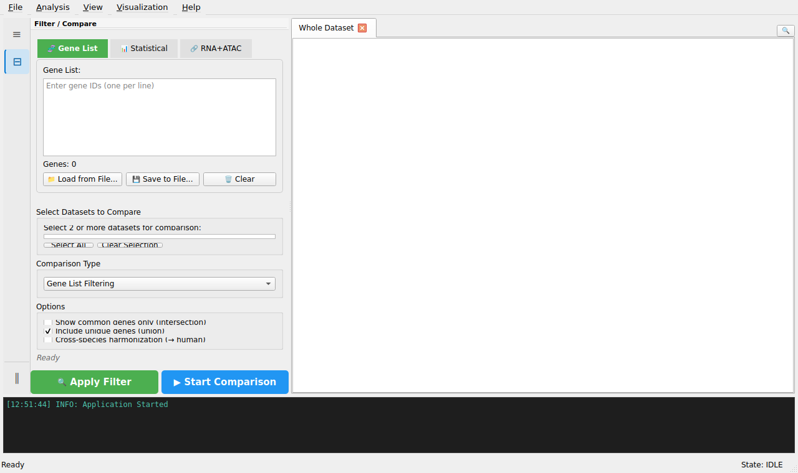

# 1. Getting Started

## 1.1 Table of Contents

All sections of this guide (numbers match the first/second-level headings; click any entry to open it):

- [1. Getting Started](01-getting-started.md)
- [2. Loading Data](02-loading-data.md)
- [3. Dataset Database](03-dataset-database.md)
- [4. Data Filtering](04-data-filtering.md)
- [5. GO/KEGG Analysis](05-go-kegg-analysis.md)
- [6. GO/KEGG Enrichment Analysis](06-go-enrichment-analysis.md)
- [7. GO Term Comparison](07-go-term-comparison.md)
- [8. Statistical Analysis](08-statistical-analysis.md)
- [9. Visualization](09-visualization.md)
- [10. Export & Clipboard](10-export-clipboard.md)
- [11. Dataset Comparison](11-dataset-comparison.md)
- [12. Gene Annotation](12-gene-annotation.md)
- [13. ATAC-seq Analysis](13-atac-seq-analysis.md)
- [14. Multi-Omics Integration](14-multi-omics-integration.md)
- [15. Multi-Group Heatmap](15-multi-group-heatmap.md)
- [16. PCA Plot](16-pca-plot.md)
- [17. Project Save/Load](17-project-save-load.md)
- [18. IGV Integration](18-igv-integration.md)
- [19. Tips & Shortcuts](19-tips-shortcuts.md)
- [20. FAQ](20-faq.md)

## 1.1 Overview

*Main window with a loaded DE dataset (GO/KEGG Enrichment Analysis is enabled in the Analysis menu).*

CMG-SeqViewer is a comprehensive tool for analyzing and visualizing
 genomic sequencing data. This application provides:

- Multi-dataset management and comparison

- Flexible filtering options (statistical, gene list, annotation-based)

- Statistical analysis tools (Fisher's Exact, GSEA)

- Interactive visualizations (Volcano, MA Plot, Heatmap, Dot Plot, Venn)

- **RNA-seq** differential expression (DE) analysis results

- **ATAC-seq** differential accessibility (DA) analysis results

- **GO/KEGG** enrichment analysis results

## 1.2 Main Interface

The interface consists of four main areas:

- **Left Panel (top):** Dataset Tree — hierarchical view of all loaded datasets
 and their derived sheets (Filtered, Comparison, Plot). Click a node to switch tabs.

- **Left Panel (bottom):**

 - Filter Panel - Apply gene list or statistical filters

 - Comparison Panel - Compare multiple datasets

- **Center:** Data View - Tabbed display of datasets and results

- **Right (auto-shown):** Plot Settings Dock — appears when a Plot tab is active;
 lets you adjust visualization parameters without opening a dialog

- **Bottom:** Log Terminal - System messages and status updates

Toggle the left/right panels from the **Panels** menu or their shortcuts:
 **Ctrl+1** (Datasets tree), **Ctrl+2** (Filter / Compare), **Ctrl+\\** (Split View).

## 1.3 Find in Sheet (Ctrl+F)

Press **Ctrl+F** anywhere (or click the 🔍 icon in the top-right corner of the
 tab bar) to open a compact search bar above the data table:

- Type a keyword — matching rows stay visible, non-matching rows are hidden
 live as you type (substring, case-insensitive)

- Searches one column per dataset type: `description`/`term_id`
 for GO/KEGG data, otherwise gene `symbol` (falls back to
 `gene_id`) — shown next to the match count

- **→ Sheet** creates a filtered child sheet from the current matches

- Press **Esc** or click **✕** to close and unhide all rows

*Note: this is different from **Apply Filter** (Ctrl+Shift+F), which creates
 a new filtered sheet based on statistical or gene-list criteria — see section 4.*

## 1.4 Menu Bar

All menus are always accessible. The application will show appropriate error messages
 if an operation cannot be performed in the current context.

- **File:** Open datasets, database browser, recent files, export data,
 **Save/Open Project** (.seqproj)

- **Analysis:** Filtering, Fisher's Exact Test, GSEA, dataset comparison,
 **🌡️ Multi-Group Heatmap**

- **View:** Column display level, decimal precision

- **Visualization:** Volcano plots, histograms, heatmaps, PCA plots, dot plots, Venn diagrams,
 **📊 Gene Expression Bar+Scatter (Grouped)**

- **Help:** About dialog and user documentation

---
**See also**: [User Guide](../user-guide.md) · [FAQ](20-faq.md)
