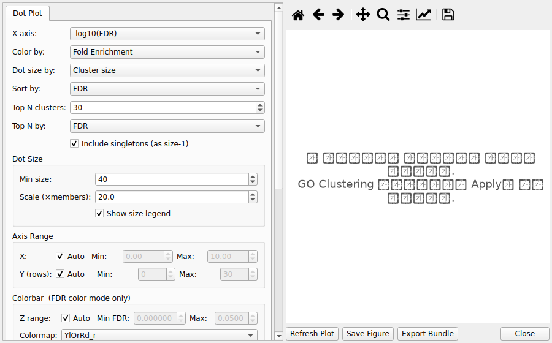
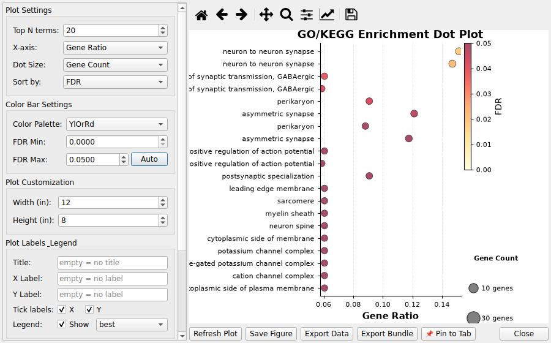
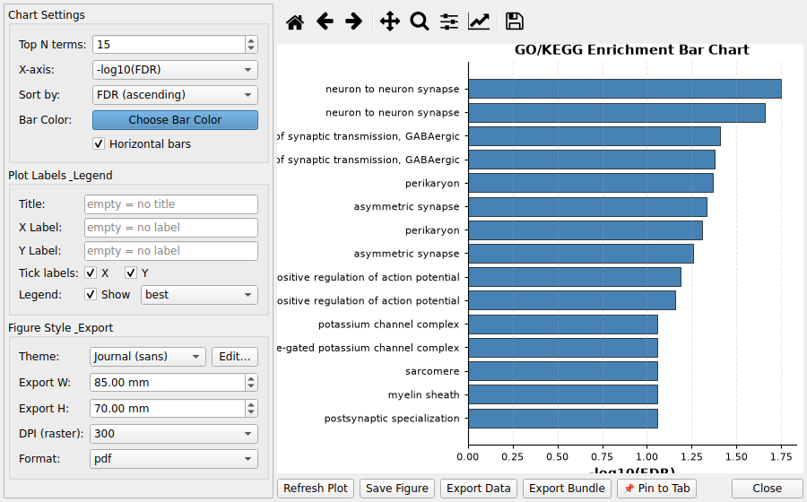
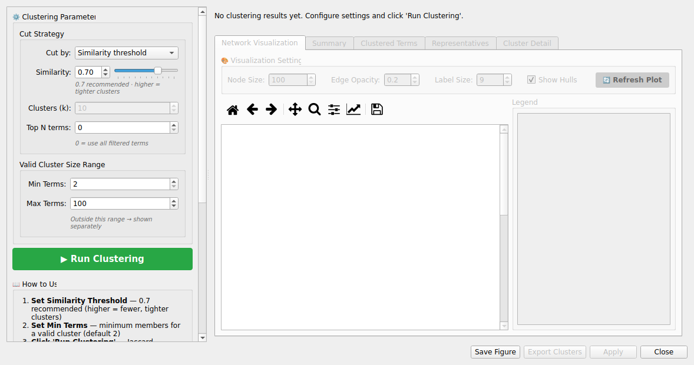

# 5. GO/KEGG Analysis

## 5.1 Overview

CMG-SeqViewer provides specialized tools for Gene Ontology (GO) and KEGG pathway enrichment analysis.

## 5.2 Loading GO/KEGG Data

Load enrichment results from Excel files. The tool automatically detects GO/KEGG data by column names.

## 5.3 Filtering GO/KEGG Results

Filter Panel provides specialized options:

- **FDR Threshold:** Maximum adjusted p-value (default: 0.05)

- **Ontology:** BP (Biological Process), MF (Molecular Function), CC (Cellular Component), KEGG, or All

- **Gene Set:** UP/DOWN/TOTAL (indicates which DEG group was analyzed)

*Note: "Gene Set" is different from "Regulation" - it shows which DEG group was used for GO analysis.*

## 5.4 GO Term Clustering

Jaccard-similarity hierarchical clustering merges redundant GO terms:

1. Filter the GO/KEGG dataset (e.g., FDR < 1e-5, BP, UP)

2. Select **Analysis → Cluster GO Terms**

3. Choose **Cut by** — only the relevant control is enabled:

 - **Similarity threshold** (default) — data-driven; keeps all clusters +
 singletons:
 **Similarity** spinbox/slider 0.0–1.0
 (default 0.7 — higher is stricter, fewer clusters)

 - **Number of clusters (k)** — cuts the tree at exactly **k**
 (2–100) clusters (cutree); good for compact summaries

4. **Top N terms** (optional) — 0 uses all filtered terms; N > 0 pre-selects
 the top N terms by FDR before clustering — e.g. combine 50 +
 "Number of clusters (k)" for an easy-to-read compact summary.
 Changing this requires **Run Clustering** again (the tree must be recomputed)

5. **Min / Max Terms** (Valid Cluster Size Range) — clusters outside this
 range are flagged separately (default Min 2, Max 100)

6. Run **Run Clustering** and inspect the 5 result tabs:

 

 - **Network Visualization:** per-cluster Jaccard network grid; click a cell to zoom in the Cluster Detail tab

 - **Summary:** total terms, valid cluster count, singleton count

 - **Clustered Terms:** every term gets a C001/C002… cluster ID

 - **Representatives:** representative term (lowest FDR) per valid cluster

 - **Cluster Detail:** enlarged single-Jaccard-network view of the selected cluster

7. **Live threshold re-cutting:** after Run, changing **Similarity** or **k**
 reclassifies/redraws immediately without full recomputation (the hierarchy
 tree is cached), so you can compare thresholds quickly

8. Click **Apply** to create the Clustered tab (with cluster ID column)

### Figure Style & Export

Click the **🎨 Figure Style & Export...** button in the left panel to open a
small popup dialog for theme/colors and export size·DPI·format
(opened as a separate window to save panel space). Style changes apply
immediately to the Network Visualization grid.

### Algorithm summary

9. Jaccard similarity: shared genes of two terms ÷ union genes

10. Hierarchical clustering (average linkage); Similarity mode uses a distance
 threshold = 1 − Similarity Threshold; k mode cuts the tree at exactly k clusters

11. Clusters below Min Terms are classified as singletons (no cluster ID)

12. Representative term = lowest-FDR term in each cluster

13. Cluster IDs: C001, C002… format (0-padded, string-sortable)

### Post-clustering visualization

14. With the Clustered tab active, run **Visualization → Cluster Dot Plot**

15. Each dot = cluster representative term; dot size = member count, color = FDR

## 5.5 GO/KEGG Visualization

### Dot Plot:



16. Select **Visualization → GO/KEGG Dot Plot**

17. Dot size: gene ratio, gene count, or fixed

18. Dot color: FDR, p-value, or q-value

19. Shows top N enriched terms

### Bar Chart:



20. Select **Visualization → GO/KEGG Bar Chart**

21. Shows -log10(FDR) for top terms

22. Color-coded by ontology

### Cluster Dot Plot:



23. Select **Visualization → GO/KEGG Cluster Dot Plot**

24. Requires Clustered tab (run GO Clustering first)

25. One dot per cluster representative term

26. Dot size = cluster member count, color = FDR

27. X axis: -log10(FDR), Gene Ratio, or Fold Enrichment

## 5.6 End-to-end workflow example (pipeline results)

A complete round trip with pipeline-generated results, from import to a clustered
dot plot.

1. **Import** a pipeline result: *File → Load Data...* →
 `final_go_result.xlsx` (multi-sheet: `DOWN_BP`, `TOTAL_BP`, `KEGG_DOWN`, ...).
 The loader standardizes columns and derives `direction`/`ontology`/`_gene_set`
 exactly like in-app results — the same standard column order.

2. **Filter** (*Filter Panel*): FDR < 0.05, Ontology = BP, Gene Set = DOWN
 (the filter matches the pipeline sheet labels `DOWN_BP` etc.).

3. **Cluster** (*Analysis → Cluster GO Terms*): keep the defaults
 (Similarity threshold 0.7, Min/Max 2–100) and click **Run Clustering**, then
 **Apply**.

4. **Visualize** — the four views share the same registered dataset:

 - *Visualization → GO/KEGG Dot Plot* — 
 - *Visualization → GO/KEGG Bar Chart* — 
 - *Visualization → GO/KEGG Cluster Dot Plot* (requires the Clustered tab) — 
 - The **Network Visualization** tab inside the clustering dialog — 

5. **Export**: *Export* the active tab to Excel/CSV/Parquet or save the figure
 (PNG/SVG/PDF) from the plot panels.

> **Screenshot note**: the figures above are rendered by the app on demo data.
> For release documentation, replace them with captures from the deployed
> (Windows/macOS) build — keep the same file names under
> `docs/user/help/assets/` so the markdown references stay valid.


## 5.7 Common Workflows

**Basic Analysis:**

1. Load GO data

2. Filter (FDR < 0.05, BP, UP)

3. Create Dot Plot

4. Export results

**Clustered Analysis:**

1. Load GO data

2. Filter (FDR < 1e-5, BP)

3. Cluster GO Terms

4. Apply clustering

5. Create Cluster Dot Plot

6. Export clustered results

## 5.8 GO Term List Filtering

Filter a GO/KEGG dataset to a specific set of GO term IDs — useful when you already know
 which terms you want to compare across datasets.

### How to use

1. Make sure a **GO/KEGG dataset tab** is active

2. Open the **Filter Panel** and select the **Gene List** tab

3. Enter GO term IDs (one per line) — e.g.:

```
GO:0006915
GO:0007049
GO:0008150

            Click Apply Filter**

            A new tab appears: "Filtered: GO Term List (N terms)"*

        Notes

            GO term IDs must follow the GO:XXXXXXX` or KEGG:xxxXXXXX` format

            If the active dataset is not a GO/KEGG type, or if non-GO IDs are entered into
                Gene Symbol mode, the app shows a warning and aborts

            The filter matches against the term_id` / go_id` column
                of the GO dataset

            Filtered results can be passed directly to the GO Term Comparison workflow

        Best Practices

            Filter to meaningful FDR before clustering (< 1e-5 recommended)

            Cluster each ontology (BP, MF, CC) separately

            Start with 0.3 similarity threshold, increase for fewer clusters

            Focus on representative terms for biological interpretation

            Re-filter Filtered tabs to narrow down results further

---
**See also**: [User Guide](../user-guide.md) · [FAQ](20-faq.md) · [6.3 Engine modes](06-go-enrichment-analysis.md#6-3-engine-modes-summary)
