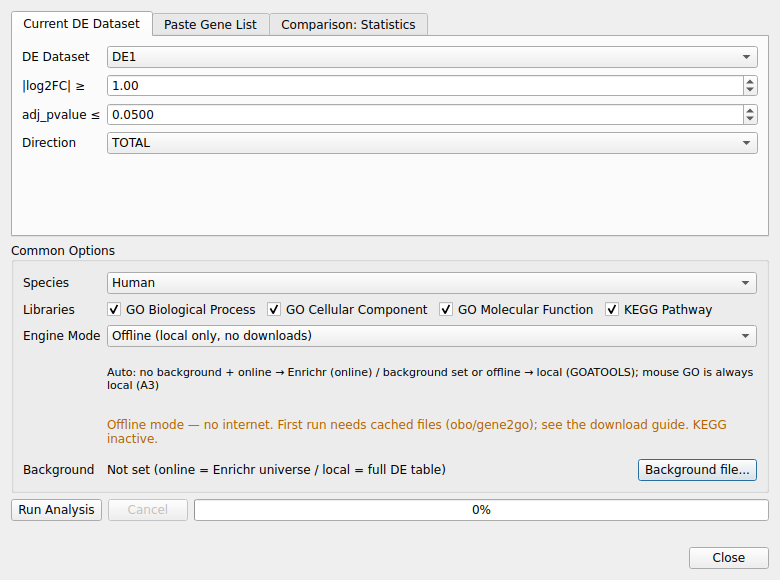

# 6. GO/KEGG Enrichment Analysis

Extracts DEGs from a loaded DE dataset (or a pasted gene list, or a
Comparison: Statistics meta sheet) and runs on-the-fly GO (BP/CC/MF) and KEGG
pathway enrichment.

1. Prepare a DE dataset (or the current Comparison: Statistics sheet), then select
 **Analysis → GO/KEGG Enrichment Analysis...**
2. Choose the input source tab (Current DE / Paste / Comparison), thresholds,
 species (Human/Mouse), libraries, and engine mode
3. On completion an "Enrichment: …" Dataset is registered and can be reused in the
 existing Bar / Dot / Clustering / Network visualizations

*Enrichment Analysis dialog with the Paste Gene List source selected.*

## 6.1 End-to-end workflow example (Acute 1D data)

A complete round trip with the bundled example data, from DE results to a
published dot plot.

1. **Load the DE result.** Use *File → Load Data...* and pick
 `examples/Acute_1D_vs_Control_DA.parquet` (already registered by the database
 auto-loader in most installs; you can also use any loaded DE dataset).

2. **Open the analysis dialog.** `Analysis → GO/KEGG Enrichment Analysis...`
 (enabled whenever a DE dataset is present).

3. **Choose the source and thresholds** (Current DE tab):
 - DE Dataset: `Acute 1D vs Control`
 - |log2FC| ≥ 1.0, adj_pvalue ≤ 0.05, Direction: **TOTAL only**
 - Species: Human (default); Libraries: GO BP/CC/MF + KEGG

 The **Direction** dropdown has four choices: **TOTAL only** (all significant
 genes regardless of sign), **UP**, **DOWN**, or **UP + DOWN + TOTAL** (runs
 all three and merges them into a single dataset — use this to match the
 pipeline-import Excel format, which always has UP/DOWN/TOTAL sheets side by
 side). UP/DOWN/TOTAL-combined is only available for the Current DE Dataset
 source, since Paste/Comparison inputs are a flat gene list with no
 per-gene fold-change to split by direction.

4. **Engine mode — pick your context:**
 - **Auto** (recommended): online Enrichr when the network is available and no
 custom background is set; otherwise GOATOOLS local.
 - **Online**: Enrichr for GO + KEGG (enrichr fixed universe is the background).
 - **Local / Offline**: GOATOOLS with the full DE table as the population;
 KEGG is inactive offline (v1, ADR-1 Option 1).
 - A **custom background file** forces the local engine (ADR-2 2A).

5. **Run.** The progress bar advances through DEG extraction → mapping →
 enrichment → standardization. On success the dialog shows
 `Done: N terms (engine=...)` and registers **`Enrichment: Acute 1D vs Control`**
 under *GO_ANALYSIS*.

6. **Visualize with the existing tools** (the new dataset feeds the same pipeline
 as imported GO/KEGG results — identical standard columns and order):
 - *Visualization → GO/KEGG Dot Plot* (or the other GO menus)
 - Terms carry a plain `gene_set` value of `UP` / `DOWN` / `TOTAL` (ontology is
 a separate column) — the same values pipeline-imported Excel sheets use, so
 the direction/ontology filters work identically either way.

7. **Export** the result tab (Excel/CSV/Parquet) — the exported file includes the
 standard contract columns plus `_gene_set`.

> **Interpretation note**: online (Enrichr), local (GOATOOLS), and prerank engines
> use different statistical methods and backgrounds — numbers differ across modes
> by design; compare trends, not absolute p-values (engine-difference caveat, plan P3-4).

## 6.2 Meta-signature enrichment (Comparison: Statistics)

1. Run *Analysis → Compare Datasets* with 2+ datasets; open the
 **Comparison: Statistics** tab.
2. Open the enrichment dialog and switch to the **Comparison: Statistics** tab.
3. Set the meta FDR cutoff (default 0.05); optionally require `meta_direction`
 concordant rows.
4. Choose the analysis method:
 - **ORA (over-representation)** — meta-DEG → Enrichr/GOATOOLS ORA.
 - **GSEA prerank (gseapy, international gene sets)** — meta ranking
 (`meta_z` or `−log10(p) × sign(effect)`) → `gseapy.prerank` against cached
 GMT snapshots (works offline). Results preserve **NES / FWER** columns.
5. The result registers as usual; metadata records `meta_combined_datasets` and
 `gsea_method`.

> **Name distinction (A7)**: *GSEA Lite (Wilcoxon)* in the Analysis menu is the
> built-in rank-based GSEA on predefined in-app gene sets; *GSEA prerank (gseapy)*
> above is the GO/KEGG enrichment pipeline's prerank path with international
> gene sets (GO/KEGG) and is a separate feature.

## 6.3 Engine modes (summary)

- **Online (Enrichr)**: fastest, database-rich; sends only the DEG symbols; no
 custom background (2A forces local).
- **Local (GOATOOLS)**: full offline-capable GO; uses the DE table as population;
 recommended for mouse (no online mouse GO library).
- **Offline**: no network; requires the cache (obo/gene2go) from any previous run;
 KEGG inactive.
- **Auto**: online when possible without a custom background, else local.
- **Background file**: custom gene list as population → local engine only.

## 6.4 Cache & reproducibility

- First run downloads `go-basic.obo`, `gene2go`, `gene_info`, and GMT snapshots into
 the AppData cache (`HTTPS_PROXY` respected, sha256-verified, TTL auto-refresh).
- Every result's metadata keeps an `enrichment_recipe` (serialized request) so the
 same analysis can be re-run or audited; **auto re-run on load is a v1 non-goal** —
 export the table for long-term storage.

**Annotation snapshot pinning (reproducibility)** — GO p-values depend on the
date of the `gene2go`/GMT annotation snapshot, so results shift when the cache
auto-refreshes (validated: pipeline vs current snapshot differ in term sizes M
and hit counts k, which shifts significance). For reproducible or
pipeline-comparable runs:

- Pin the snapshot: `CacheManager(..., pin_snapshots=True)` — an existing cached
  file is then never TTL-refreshed; the same sha256 snapshot is reused. Delete
  the cache file to refresh explicitly.
- Every result records the used snapshots under metadata `annotation_snapshots`
  ({kind: file, sha256, fetched_at, source}).
- To match an older pipeline exactly, pin the same annotation version it used
  (same-source `gene2go` date or the pipeline GMT snapshot).

**Statistic (one-sided vs two-sided)** — Local GOATOOLS uses **two-sided** Fisher
by default (more conservative). The pipeline/clusterProfiler convention is
**one-sided (enrichment)** Fisher; on identical annotation counts the two agree
(ρ=1.000). To match pipeline p-values, enable **“One-sided Fisher (enrichment,
matches pipeline statistics — local GO)”** in the analysis dialog
(`enrich_ora(..., one_sided=True)`). The used statistic is recorded in metadata
`stat_test` (`fisher_one_sided` / `fisher_two_sided`).

---
**See also**: [User Guide](../user-guide.md) · [FAQ](20-faq.md)
