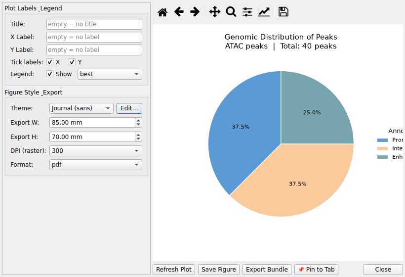

# 13. ATAC-seq Analysis

CMG-SeqViewer supports ATAC-seq Differential Accessibility (DA) results
 in addition to RNA-seq DE data. The application automatically detects ATAC-seq
 data on load based on the presence of a `peak_id` column.

## 13.1 Loading ATAC-seq Data

Use **File → Open ATAC-seq Dataset…** or drag-and-drop an Excel/Parquet file.
 Supported formats match the standard DESeq2 DA output (HOMER-annotated):

| Standard column| Accepted input names

| peak_id| peak_id, peakid, peak_name, interval

| chromosome| chr, chromosome, seqnames

| peak_start / peak_end| start / end, startpos / endpos

| nearest_gene| gene_name, nearest_gene, symbol

| annotation| annotation, peak_annotation, feature

| distance_to_tss| distancetotss, distance_to_tss, distance.to.tss

| base_mean| baseMean, base_mean, conc

| log2fc| log2FoldChange, log2fc, logFC

| adj_pvalue| padj, adj_pvalue, FDR

| direction| direction, regulation

A `peak_width` column is automatically calculated as
 `peak_end − peak_start`.

## 13.2 Column Display Levels

Use **View → Column Display Level** to adjust visible columns:

- **Basic:** peak_id, chromosome, peak_start, peak_end, nearest_gene

- **Stat:** Basic + base_mean, log2fc, pvalue, adj_pvalue, direction

- **Full:** Stat + lfcse, annotation, distance_to_tss, gene_id, peak_width

## 13.3 ATAC-seq Filtering (Statistical tab)

When an ATAC-seq dataset is active, the **ATAC-seq Filtering** section
 becomes visible below the standard DE filters:

- **Annot:** Filter by genomic annotation category
 (e.g., Intergenic, Intron, Promoter-TSS). Categories are populated
 automatically from the loaded data.

- **|TSS| ≤:** Keep only peaks whose absolute distance to the nearest
 TSS is within the specified number of base pairs.

- **Peak Width:** Filter by minimum and/or maximum peak width (bp).

Statistical filters (adj. p-value, |log2FC|, direction) also apply to ATAC-seq data.

## 13.4 Gene List Filtering

Paste **gene symbols** (nearest gene names) into the Gene List tab, one per line.
 The filter matches against the `nearest_gene` column.

## 13.5 ATAC-seq Visualizations

When an ATAC-seq tab is active, three dedicated plots are available under
 **Visualization**:

### Genomic Distribution

- Pie chart of peak annotation categories (Intergenic, Intron, Promoter-TSS, Exon, TTS, …)

- HOMER/ChIPseeker annotation strings are normalized to broad categories automatically

- Shows peak count and percentage per category

### TSS Distance Plot

- Histogram of peak distances to the nearest TSS

- Default range: ±50,000 bp; configurable with Range and Bins controls

- Reference lines at 0 bp (TSS), ±2 kb, ±5 kb

- Summary bar: % peaks within ≤2 kb and ≤5 kb from TSS

### MA Plot

- X axis: log₂(base mean accessibility); Y axis: log₂ fold change

- Points colored by regulation direction (Up / Down / Not Significant)

- Configurable adj. p-value and |log2FC| thresholds

- Gene label annotation: Top N by |log2FC|, or custom gene list

- Hover tooltip shows nearest_gene, log2FC, base mean, adj. p-value

The standard **Volcano Plot** also works with ATAC-seq data
 (uses log2fc and adj_pvalue columns).

## 13.6 TF Motif Enrichment

Visualizes transcription-factor motif enrichment results from
 **HOMER** (`knownResults.txt`) or **MEME AME**
 (`ame.tsv`) as a horizontal bar chart.

- Load via **File → Open TF Motif Results...** — this creates a
 dedicated *TF Motif* dataset tab (separate from the ATAC DA tab)

- With that tab active, open **Visualization → 🔓 ATAC-seq →
 🔡 TF Motif Enrichment Plot**

- **Top N motifs:** how many TFs to show, ranked by −log₁₀(p-value)

- **Q-value cutoff:** only motifs at/below this q-value are plotted

- **Show % bar:** overlays the percentage of target peaks containing each
 motif on a secondary axis

- You can load a second (e.g. DOWN) result alongside the first to get a
 side-by-side UP vs DOWN comparison plot

- **Export Data** saves the plotted table (Excel/CSV)

## 13.7 TF Footprint (TOBIAS BINDetect)

Visualizes TOBIAS BINDetect footprinting output (`bindetect_results.txt`)
 as a TF activity scatter plot.

- Load via **File → Open TF Footprint Results...** — creates a
 dedicated *TF Footprint* dataset tab

- With that tab active, open **Visualization → 🔓 ATAC-seq →
 👣 TF Activity Plot (Footprint)**

- X axis = condition 1 mean footprint score, Y axis = condition 2 mean
 footprint score (condition names come from the file's metadata);
 points above the diagonal (y=x) are more bound in condition 2,
 below are more bound in condition 1

- **P-value cutoff** and **|Change| ≥** control which TFs are
 highlighted/colored as significant

- **Label top N** annotates the top TFs by |change|; **Dot size** and
 **Show diagonal** are also adjustable

- **Export Data** saves the plotted table

## 13.8 chromVAR TF Activity

Visualizes chromVAR differential TF activity (deviation z-scores) results.

- Load via **File → Open chromVAR Results...** (CSV/Parquet
 `diff_tf` output) — creates a dedicated *chromVAR*
 dataset tab. Loading more than one chromVAR result enables a
 multi-condition mode.

- With that tab active, open **Visualization → 🔓 ATAC-seq →
 🧬 chromVAR TF Activity Plot**

- **View** mode:

 - **Volcano** — X: delta z-score, Y: −log₁₀(padj)

 - **Scatter (base vs compare)** — X: base/control condition
 z-score, Y: comparison condition z-score

 - **Multi-condition Heatmap** (only when 2+ chromVAR datasets are
 loaded) — TF × condition matrix of delta z-scores

- **padj cutoff** and **|delta| ≥** control significance
 highlighting; **Label top N** and **Dot size** adjust display;
 **Heatmap top N TFs** applies only in Heatmap mode

- Hovering a point in Volcano/Scatter mode shows TF name, motif ID, delta,
 and padj

## 13.9 Annotation Column Explained

ATAC-seq peaks are annotated with a genomic context string (HOMER format):

- `annotation` — the gene body that the peak **physically overlaps**
 (e.g., “intron (ENSMUSG00000097836, intron 2 of 4)”)

- `nearest_gene` + `gene_id` — the gene whose
 **TSS is closest** to the peak center (used for regulatory interpretation)

These can differ: a peak may overlap an intron of a large gene (annotation) while
 the nearest TSS belongs to a different gene (nearest_gene). For downstream analysis
 (e.g., gene list filtering), `nearest_gene` is used.

## 13.10 End-to-end workflow example (pairwise ATAC-seq)

A concrete round trip with a pairwise ATAC-seq experiment (e.g. `Chronic_200uM vs Control`):

1. **Load the peaks**: *File → Load Data...* → `final_da_result.xlsx` or a peaks
   parquet (peak_id/chr/start/end/nearest_gene columns). The type is detected
   automatically as ATAC-seq.

2. **Set display level**: switch the column display level to e.g. **Full** to see
   peak-level stats alongside annotations (Annotation/Gene/Peak tabs).

3. **Filter** (*Filter Panel → Statistical tab*): FDR < 0.05, direction UP/DOWN,
   log2FC threshold — the filter applies to `adj_pvalue`/`log2fc`/`direction`.

4. **Explore the peak-centric views**: *Visualization → Genomic Distribution* and
   *TSS Distance* to spot promoter enrichment; *Integrated Volcano* to combine
   RNA+ATAC significance in one plot.

5. **Regulatory follow-ups** on filtered peaks:

   - *Analysis → TF Motif Enrichment* — motif discovery on differentially
     accessible peaks.
   - *Analysis → TF Footprint* — TOBIAS BINDetect-style footprints at TF motifs.
   - *Analysis → chromVAR TF Activity* — per-sample TF activity from the
     filtered peak matrix.

6. **Export** the filtered tab or the motif/footprint tables (CSV/Excel/Parquet).

> For cross-modal concordance (ATAC + RNA), see **14. Multi-Omics Integration**.

---
**See also**: [User Guide](../user-guide.md) · [FAQ](20-faq.md) · [14. Multi-Omics Integration](14-multi-omics-integration.md)
