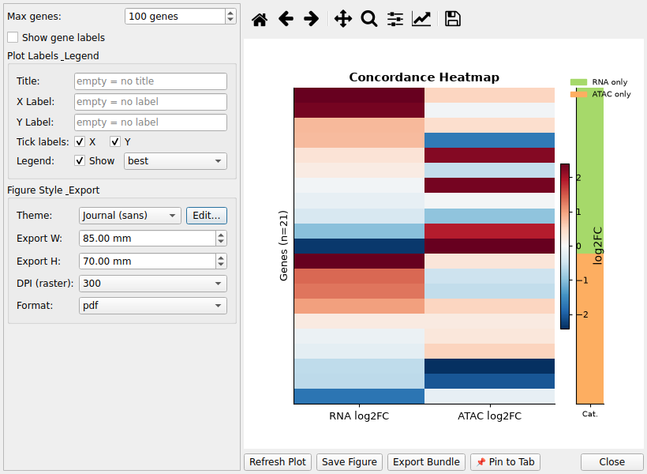

# 14. Multi-Omics Integration

## 14.1 Overview

Multi-Omics Integration combines **RNA-seq DE** results and
 **ATAC-seq DA** results to reveal genes that are both
 transcriptionally and epigenomically regulated.
 For each gene, the analysis asks: is there concordant evidence from both modalities?

## 14.2 Requirements

- At least one **RNA-seq** dataset and one **ATAC-seq** dataset loaded

- Both datasets must share gene identifiers (RNA uses `symbol`;
 ATAC uses `nearest_gene`)

## 14.3 Step-by-Step Workflow

1. Load an RNA-seq DE dataset (e.g., via **File → Open Dataset…**)

2. Load an ATAC-seq DA dataset (e.g., via **File → Open ATAC-seq Dataset…**)

3. Open **Analysis → 🔗 Integrate RNA + ATAC…**

4. In the **Multi-Omics Panel** that appears on the left:

 - Select the RNA dataset from the drop-down

 - Select the ATAC dataset from the drop-down

 - Choose an **Integration Method**

 - Set initial significance thresholds for RNA and ATAC (these are just
 starting values — see below)

5. Click **🔗 Integrate RNA + ATAC** — this opens the
 **RNA + ATAC Integration Workbench** dialog (it does **not**
 create the result tab yet)

6. In the Workbench, tune the four significance cutoffs
 (RNA padj / RNA |log2FC| / ATAC padj / ATAC |log2FC|) and the
 category style/colors on the left while watching the
 **Quadrant Plot** preview update live on the right — the
 expensive gene–peak join runs only once; re-classifying at a
 new cutoff and redrawing is fast, so you can explore several
 thresholds before committing

7. Click **Apply** in the Workbench to commit the current cutoffs —
 this creates/refreshes the result tab
 *“Multi-Omics: [RNA name] × [ATAC name]”* and closes
 the dialog. Click **Close** instead to discard without creating a tab.

To re-tune cutoffs later, reopen the Multi-Omics panel and click
 **Integrate** again — the Workbench reopens (a fresh join is computed each time).

## 14.4 Integration Methods

| Method| Description

 | **Nearest Gene**
 | All ATAC peaks whose annotated `nearest_gene` matches
 an RNA-seq gene are grouped and summarised per gene.
 Captures distal enhancers and all regulatory peaks.

 | **Promoter Only**
 | Only peaks with `|distance_to_tss|` within the TSS Window
 (default 2,000 bp) are used.
 Focuses on proximal promoter regulation.

## 14.5 Significance Thresholds

8. **RNA padj ≤:** Adjusted p-value cutoff for RNA-seq significance (default 0.05)

9. **RNA |log2FC| ≥:** Fold-change cutoff for RNA-seq (default 1.0)

10. **ATAC padj ≤:** Adjusted p-value cutoff for ATAC-seq (default 0.05)

11. **ATAC |log2FC| ≥:** Fold-change cutoff for ATAC-seq (default 0.5)

A gene is “RNA-significant” if **both** thresholds are met.
 Likewise for ATAC.

## 14.6 Concordance Categories

Each gene is assigned one of seven concordance labels:

| Category| Meaning| Color

 | **Concordant_Both_UP**
 | RNA up *and* ATAC more accessible — epigenomically supported activation
 | #D73027

 | **Concordant_Both_DOWN**
 | RNA down *and* ATAC less accessible — epigenomically supported repression
 | #4575B4

 | **Discordant_RNA_UP_ATAC_DOWN**
 | RNA up but ATAC less accessible — post-transcriptional or indirect regulation
 | #FC8D59

 | **Discordant_RNA_DOWN_ATAC_UP**
 | RNA down but ATAC more accessible — repressor activation or complex regulation
 | #74ADD1

 | **RNA_only**
 | RNA significant, no significant ATAC peaks associated
 | #F46D43

 | **ATAC_only**
 | Significant ATAC peaks but RNA not significantly changed
 | #ABD9E9

 | **Not_significant**
 | Neither RNA nor ATAC is significant
 | #CCCCCC

## 14.7 Integrated Result Columns

12. `symbol` — gene symbol

13. `rna_log2fc`, `rna_padj`, `rna_base_mean` — RNA-seq stats

14. `peak_count` — number of ATAC peaks associated with this gene

15. `atac_log2fc_mean`, `atac_log2fc_max` — ATAC log2FC summary

16. `atac_padj_min` — most significant ATAC peak p-value

17. `concordance` — one of the 7 concordance categories above

18. `regulatory_status` — human-readable regulatory interpretation

## 14.8 Visualizations (Multi-Omics only)

When a Multi-Omics integrated tab is active, the following are available
 under the **Visualization → 🔗 RNA-ATAC Integration** submenu
 (formerly labeled “Multi-Omics”):

19. **◈ Quadrant Plot** — RNA log2FC (Y) vs ATAC log2FC (X), colored by concordance

20. **🔥 Concordance Heatmap** — genes × [RNA_log2FC, ATAC_log2FC] with concordance sidebar

21. **📊 Concordance Summary** — bar chart and count/percentage table per concordance category

22. **🌋 Integrated Volcano** — RNA-seq Volcano Plot where each point is:

 - Colored by concordance category (ATAC support)

 - Sized proportionally to the number of nearby ATAC peaks (`peak_count`)

## 14.9 Export

Use **File → Export Multi-Omics Results…** to save a multi-sheet Excel file:

23. **Integrated_Summary** — all genes

24. **Concordant_UP** — Concordant_Both_UP genes

25. **Concordant_DOWN** — Concordant_Both_DOWN genes

26. **Discordant** — all discordant genes

27. **RNA_only** — RNA-significant without ATAC support

28. **ATAC_only** — ATAC-significant without RNA change

## 14.10 Typical Biological Interpretation

29. **Concordant genes** are the highest-confidence candidates for
 direct transcription-factor-driven regulation

30. **RNA_only genes** may be regulated post-transcriptionally or
 by distal enhancers outside the peak window

31. **ATAC_only regions** may indicate pre-poised enhancers or
 pioneer-factor binding without immediate transcription change

## 14.11 Example scenario

1. Load an RNA-seq DE result (`Acute_1D_vs_Control_DA.parquet`) and an ATAC-seq
   peak result for the same comparison (shared `symbol`/`nearest_gene` identifiers).
2. Open the **Multi-Omics Workbench** and select the two datasets.
3. Keep the default concordance method and thresholds; run the integration.

4. Inspect the **Integrated Result Columns** (per-gene direction, pooled
   significance, concordance category) and the *Integrated Volcano* /
   *Multi-Omics Heatmap* visualizations.
5. Export the integrated table — the concordance categories (`BOTH`, `RNA_only`,
   `ATAC_only`, `discordant`, ...) feed downstream filtering.

---
**See also**: [User Guide](../user-guide.md) · [FAQ](20-faq.md)
