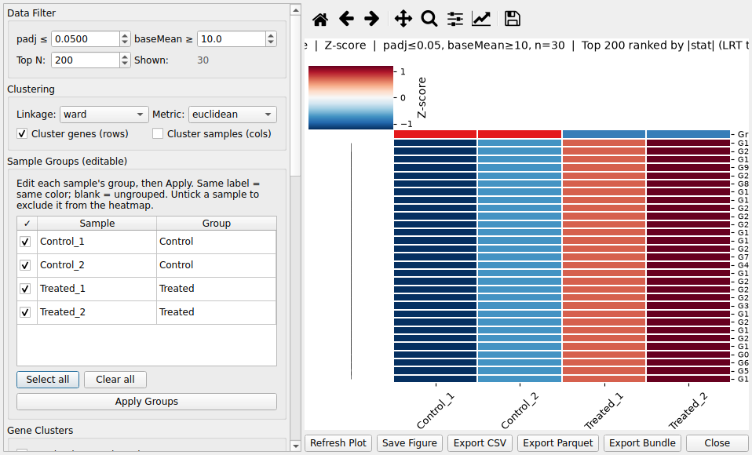

# 15. Multi-Group Heatmap

## 15.1 Overview

The Multi-Group Heatmap visualizes expression or peak values across **3 or more
sample groups/conditions** side by side — e.g. control, 1D, 24h, 3D treatment
time courses. It complements the pairwise heatmaps by giving a single view of
group-level patterns.

## 15.2 Requirements

- A **Differential Expression dataset with 3+ sample columns**, or a
  **Multi-Group dataset** (`gene_id` + `padj` + 3+ sample columns).

## 15.3 End-to-end workflow example (time course)

1. Load RNA-seq results that contain normalised sample counts (the pipeline
   writes them into the DE parquet) — e.g. `3D_vs_CONTROL` style entries with
   `Control / 24h / 3D / ...` sample columns.

2. Open *Visualization → Multi-Group Heatmap*; the dialog lists the detected
   sample columns.

3. Choose the **scaling/color** options (log2 or z-score, diverging color map)
   and the **subset** (e.g. top variable genes), then generate the heatmap.

4. Use the **sample-group legend** to read time-course trends; adjust row
   clustering if groups separate cleanly.

5. **Export** the figure (PNG/SVG/PDF) or the underlying matrix via the
   figure-bundle export.

> Require 3+ groups: with fewer groups, the pairwise heatmaps and *Dataset
> Comparison* views are more appropriate.

---
**See also**: [User Guide](../user-guide.md) · [FAQ](20-faq.md)
